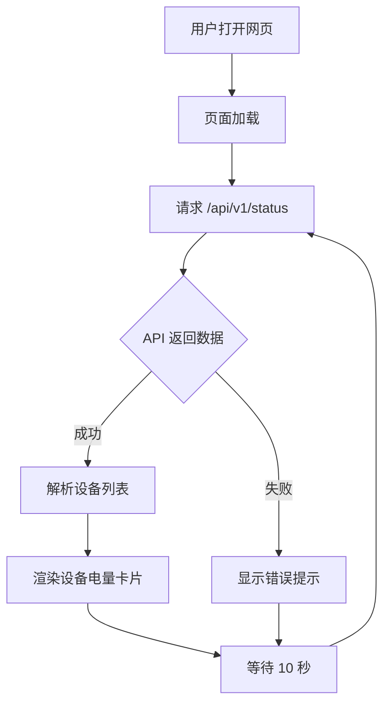

## 1. 产品概述

一个可在手机上随时查看电脑蓝牙设备电量的响应式网页。
- 目标用户：使用 EasyBluetooth 管理蓝牙设备的用户，希望在手机端便捷查看各设备的电量状态
- 解决痛点：无需打开电脑上的 EasyBluetooth 主界面，通过手机浏览器即可快速查看所有设备的电量
- 核心价值：便捷、实时、移动友好

## 2. 核心功能

### 2.1 用户角色
| 角色 | 使用方式 | 核心能力 |
|------|----------|----------|
| 普通用户 | 手机浏览器访问 | 查看设备电量列表、查看充电状态、自动刷新 |

### 2.2 功能模块
1. **设备电量仪表盘页面**：展示所有已连接蓝牙设备的电量信息
2. **自动数据刷新**：定时从 EasyBluetooth API 拉取最新设备状态
3. **移动端适配**：针对手机屏幕优化的布局和交互

### 2.3 页面详情
| 页面名称 | 模块名称 | 功能描述 |
|----------|----------|----------|
| 仪表盘 | 设备卡片列表 | 以卡片形式展示每个设备的名称、电量百分比、充电状态 |
| 仪表盘 | 电量指示器 | 圆形进度条或电池图标显示电量，颜色随电量变化 |
| 仪表盘 | 状态标签 | 显示设备在线/离线/休眠状态、上次更新时间 |
| 仪表盘 | 自动刷新 | 每隔 10 秒自动刷新数据，显示上次刷新时间 |
| 仪表盘 | 多电量设备 | 支持展示 TWS 耳机（左耳/右耳/充电盒）等多电量设备 |

## 3. 核心流程

用户打开网页 → 页面加载并调用 EasyBluetooth API → 获取设备列表 → 渲染设备电量卡片 → 每 10 秒自动轮询更新数据

## 4. 用户界面设计

### 4.1 设计风格
- **主色调**：深色系背景 (#0a0a1a)，科技感蓝紫色渐变
- **强调色**：电量颜色按梯度变化（红色 < 20% → 橙色 < 50% → 绿色 ≥ 50%）
- **卡片风格**：毛玻璃效果（半透明背景 + 模糊），圆角卡片，微光边框
- **字体**：系统无衬线字体，数字使用等宽字体便于阅读
- **布局**：垂直流式布局，适配手机窄屏单列展示

### 4.2 页面设计概览
| 页面名称 | 模块名称 | UI 元素 |
|----------|----------|---------|
| 仪表盘 | 顶部标题 | 应用标题 + 设备总数 + 上次刷新时间 |
| 仪表盘 | 设备卡片 | 设备图标、名称、环形电量进度条、百分比数字、充电图标 |
| 仪表盘 | 多电量卡片 | TWS 设备左右耳+充电盒三组电量指示 |
| 仪表盘 | 状态信息 | 在线/离线/休眠标签、连接状态、更新时间 |
| 仪表盘 | 刷新控制 | 手动刷新按钮 + 自动刷新倒计时指示 |

### 4.3 响应式设计
- 手机优先（Mobile-first），最小宽度 320px
- 卡片在手机上全宽排列，平板或桌面可 2 列排列
- 触控友好的按钮和交互区域（最小 44px 触控目标）
- 深色模式，更适合在弱光环境下查看

## 5. 技术约束
- 前端：纯 HTML + CSS + JavaScript，无需构建工具
- 后端：Node.js 轻量 HTTP 服务器，提供页面服务并代理 EasyBluetooth API
- 数据源：EasyBluetooth 统一设备电量 HTTP 接口（本地 127.0.0.1:18080）
- 部署：在运行 EasyBluetooth 的电脑上启动 Node.js 服务，手机通过局域网 IP 访问
