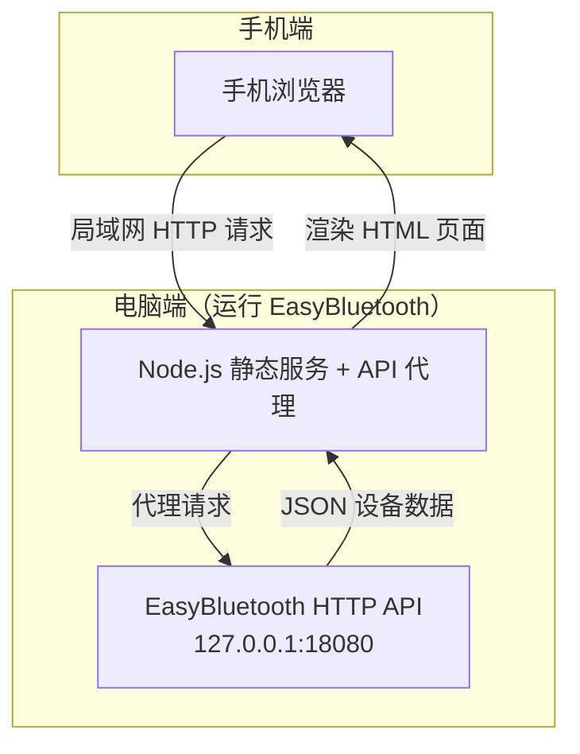
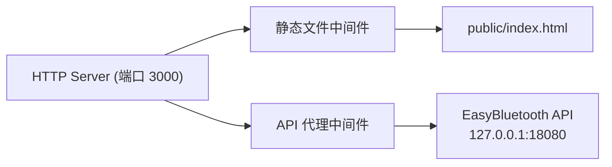

## 1. 架构设计



## 2. 技术选型

| 层级 | 技术 | 说明 |
|------|------|------|
| 前端 | 纯 HTML + CSS + JS | 零依赖，无需构建工具 |
| 后端 | Node.js (http + http-proxy) | 轻量 HTTP 服务器 |
| API 代理 | Node.js http 模块 | 将 /api/status 代理到 EasyBluetooth API |
| 数据源 | EasyBluetooth HTTP API | 本地 127.0.0.1:18080 |

## 3. 路由定义

| 路由 | 用途 | 方法 |
|------|------|------|
| / | 设备电量仪表盘页面 | GET |
| /api/status | 代理到 EasyBluetooth 的 /api/v1/status | GET |
| /api/status/* | 通配代理到 EasyBluetooth API | GET |

## 4. API 定义

### EasyBluetooth API（通过代理转发）

```typescript
// 响应结构
interface ApiResponse {
  code: number;
  message: string;
  data: {
    schemaVersion: number;
    generatedAtUtc: string;
    appVersion: string;
    devices: DeviceInfo[];
  };
}

interface DeviceInfo {
  id: string;
  name: string;
  renamedName: string | null;
  deviceType: 'general' | 'headphones' | 'mouse' | 'keyboard' | 'speaker' | 'gamepad';
  source: string;
  status: 'online' | 'offline' | 'unknown';
  connectionStatus: string;
  battery: number | null;
  isCharging: boolean;
  isSleeping: boolean;
  isBatteryUnsupported: boolean;
  isShownInTray: boolean;
  batteryLastUpdatedUtc: string | null;
  airPodsLeftBattery: number | null;
  airPodsRightBattery: number | null;
  airPodsCaseBattery: number | null;
}
```

### 代理 API

| 端点 | 方法 | 说明 |
|------|------|------|
| GET /api/status | GET | 代理转发到 EasyBluetooth API，支持 X-Api-Token 透传 |

## 5. 服务器架构



## 6. 数据模型

### 6.1 前端状态模型

```typescript
interface AppState {
  devices: DeviceDisplay[];
  lastUpdated: string | null;
  isError: boolean;
  errorMessage: string;
  isRefreshing: boolean;
  countdown: number;
}

interface DeviceDisplay {
  id: string;
  displayName: string;
  deviceType: string;
  status: 'online' | 'offline' | 'unknown';
  battery: number | null;
  isCharging: boolean;
  isSleeping: boolean;
  isBatteryUnsupported: boolean;
  connectionStatus: string;
  batteryLastUpdatedUtc: string | null;
  // TWS 多电量
  leftBattery: number | null;
  rightBattery: number | null;
  caseBattery: number | null;
}
```

## 7. 文件结构

```
f:\eazy\
├── .trae/documents/
│   ├── PRD.md
│   └── technical-architecture.md
├── server.js          # Node.js 服务入口
├── public/
│   └── index.html     # 前端页面
└── package.json       # 项目配置
```

## 8. 启动方式

```bash
cd f:\eazy
npm install
node server.js
# 服务启动在 http://0.0.0.0:3000
# 手机通过 http://电脑局域网IP:3000 访问
```
